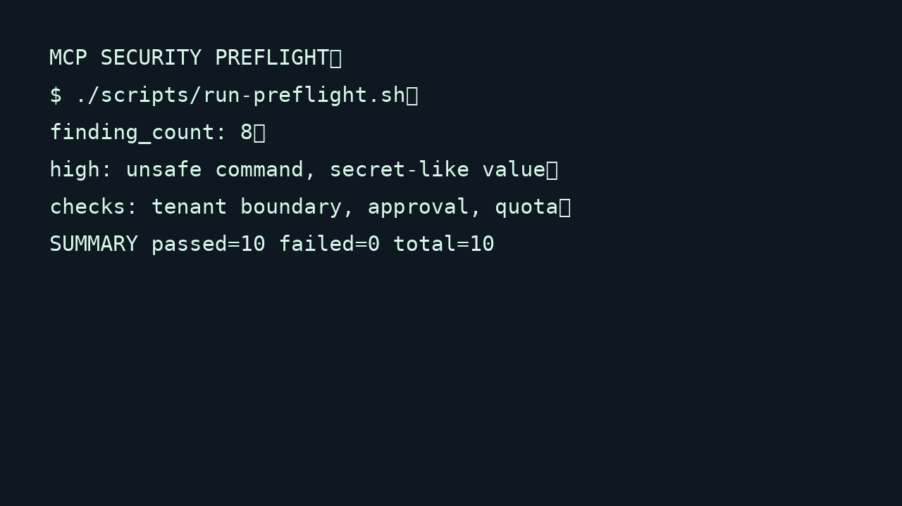

# MCP Security Preflight

A local synthetic pre-release check for MCP tool metadata, permission scope, unsafe commands, secret-like values, tenant boundaries, approvals, and quotas.

## Business story

Before: a team reviews an MCP README and a happy path. Risky declarations and denied calls are difficult to reproduce.

After: one deterministic preflight produces findings, evidence, remediation, behavior checks, JSON, Markdown, and an audit trail.

## Run

```sh
cd freelance_os/projects/mcp-security-preflight
PYTHONPATH=. python3 -m src.cli preflight
PYTHONPATH=. python3 tests/run_stdlib.py
./scripts/reset-demo.sh
```

The scanner is local-only and uses synthetic fixtures. It does not scan real targets, contact external systems, or use real credentials.

## Demo flow

1. Run the preflight and inspect `reports/run_*.md`.
2. Observe high severity command and secret findings.
3. Use the test runner to verify tenant denial, approval gating, and quota behavior.
4. Reset reports before another demo.

## Evidence

The report includes rule ID, severity, affected tool, sanitized evidence, remediation, check status, and audit fields. This is a bounded preflight, not a penetration test or certification.

## Visual demo



[Open the short GIF demo](assets/demo.gif)

---

Maintained by Kiell Tampubolon. More selected work at [kielltampubolon.id](https://www.kielltampubolon.id/).
